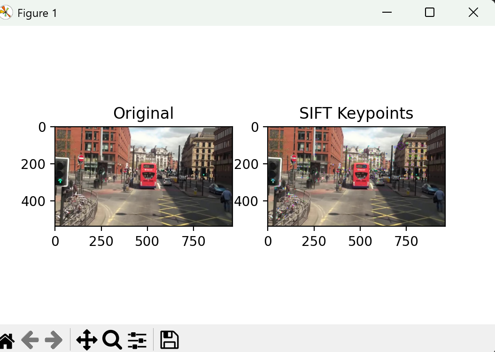
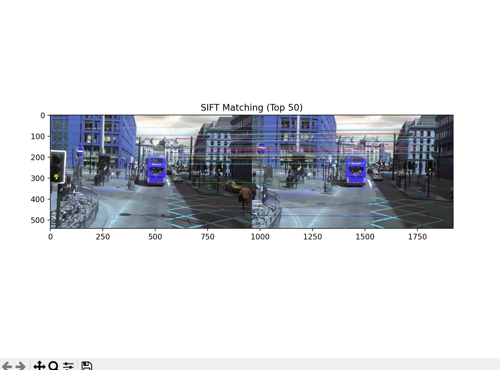
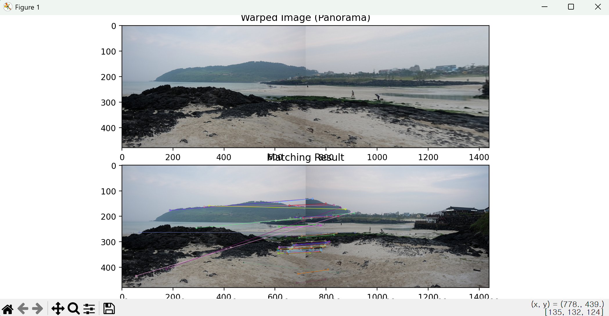

# ComVision 04주차 실습
# OpenCV 실습 과제

## 0401. SIFT를 이용한 특징점 검출 및 시각화
- **설명**: 주어진 이미지(mot_color70.jpg)를 이용하여 SIFT알고리즘을 사용한 특징점 검출
- **요구사항**:
  - cv.SIFT_create()    :SIFT 객체 생성
    - _매개변수를 변경하여 특징점 검출 결과를 비교(특징점이 너무 많다면 nfeatures값 조정)_
  - detectAndCompute()  :특징점 검출
  - cv.drawKeypoints()  :특징점을 이미지에 시각화
    - _flags=cv.DRAW_MATCHES_FLAGS_DRAW_RICH_KEYPOINTS를 설정하면 특징점의 방향과 크기도 표시_
  - matplotib           :원본 이미지와 특징점이 시각화된 이미지를 나란히 출력
- **코드**
  ```python
  import cv2 as cv # OpenCV 라이브러리 임포트
  import matplotlib.pyplot as plt # 시각화 라이브러리 임포트

  # 1. 이미지 로드 및 그레이스케일 변환
  img = cv.imread('mot_color70.jpg') # 이미지 읽기
  gray = cv.cvtColor(img, cv.COLOR_BGR2GRAY) # SIFT 처리를 위해 흑백 변환

  # 2. SIFT 객체 생성 (nfeatures로 특징점 개수 제한 가능)
  sift = cv.SIFT_create(nfeatures=500) # 특징점 최대 개수를 500개로 제한하여 객체 생성

  # 3. 특징점 검출 및 기술자 계산
  kp, des = sift.detectAndCompute(gray, None) # 이미지에서 특징점(kp)과 기술자(des)를 추출

  # 4. 특징점 시각화 (방향과 크기 표시)
  img_kp = cv.drawKeypoints(img, kp, None, flags=cv.DRAW_MATCHES_FLAGS_DRAW_RICH_KEYPOINTS) # 특징점의 크기와 방향을 포함해 그리기

  # 5. 결과 출력
  plt.figure(figsize=(12,6)) # 출력창 크기 설정
  plt.subplot(1, 2, 1), plt.imshow(cv.cvtColor(img, cv.COLOR_BGR2RGB)), plt.title('Original') # 원본 출력
  plt.subplot(1, 2, 2), plt.imshow(cv.cvtColor(img_kp, cv.COLOR_BGR2RGB)), plt.title('SIFT Keypoints') # 특징점 출력
  plt.show() # 시각화
  ```
- **주요코드**
  ```python
  cv.SIFT_create(nfeatures=500)      #이미지에서 추출할 특징점의 최대 개수를 설정하여 SIFT 알고리즘 객체를 생성
  sift.detectAndCompute(gray, None)  #이미지의 밝기 변화를 분석해 특징점 위치와 해당 점의 특징(기술자)을 동시에 계산
  flags=cv.DRAW_RICH_KEYPOINTS       #단순한 점이 아니라 특징점의 크기(Scale)와 방향(Orientation)을 원과 선으로 상세히 표시
  ```
- **결과물**:



## 0402. SIFT를 이용한 두 영상 간 특징점 매칭
- **설명**: 두 개의 이미지(mot_color70.jpg, mot_color83.jpg)를 입력받아 SIFT 특징점 기반으로 매칭을 수행하고 결과를 시각화
- **요구사항**:
  - cv.imread()                             :두 개의 이미지를 불러옴
  - cv.SIFT_create()                        :특징점 추출
  - cv.BFMatcher()/cv.FlannBasedMatcher()   :두 영상 간 특징점 매칭
    - _FLANN 기반 매칭을 원한다면 FlannBasedMatcher()를 사용_
    - _BFMatcher(cv.NORM_L2, crossCheck=True)을 사용하면 간단한 매칭 가능_
    - _KnnMatch()와 DMatch() 객체를 활용하여 최근접 이웃 거리 비율을 적용하면 매칭 정확도를 높일 수 있음_
  - cv.drawMatches()                        :매칭결과 시각화
  - matplotib                               :매칭 결과 출력
- **코드**
  ```python
  import cv2 as cv # OpenCV 임포트
  import matplotlib.pyplot as plt # 시각화 임포트

  # 1. 두 이미지 로드
  img1 = cv.imread('mot_color70.jpg') # 첫 번째 이미지
  img2 = cv.imread('mot_color83.jpg') # 두 번째 이미지

  # 2. SIFT 특징점 및 기술자 추출
  sift = cv.SIFT_create() # SIFT 객체 생성
  kp1, des1 = sift.detectAndCompute(img1, None) # 첫 번째 이미지 특징 추출
  kp2, des2 = sift.detectAndCompute(img2, None) # 두 번째 이미지 특징 추출

  # 3. BFMatcher 객체 생성 및 매칭 수행
  bf = cv.BFMatcher(cv.NORM_L2, crossCheck=True) # L2 거리를 사용하고 서로 일치하는 점만 찾는 매처 생성
  matches = bf.match(des1, des2) # 두 기술자 집합 간의 최적 매칭 수행

  # 4. 거리에 따라 매칭 결과 정렬 (정확도 높은 순)
  matches = sorted(matches, key=lambda x: x.distance) # 매칭 거리가 짧은(유사한) 순서대로 정렬

  # 5. 매칭 결과 그리기 (상위 50개만)
  img_match = cv.drawMatches(img1, kp1, img2, kp2, matches[:50], None, flags=cv.DrawMatchesFlags_NOT_DRAW_SINGLE_POINTS) # 매칭 쌍 시각화

  # 6. 결과 출력
  plt.figure(figsize=(15,7)) # 출력 크기 설정
  plt.imshow(img_match) # 매칭 결과 표시
  plt.title('SIFT Matching (Top 50)') # 제목 설정
  plt.show() # 출력
  ```
- **주요코드**
  ```python
  cv.BFMatcher(cv.NORM_L2, crossCheck=True)  #모든 특징점을 일일이 비교(Brute-Force)하며, 양방향에서 서로 가장 일치하는 점만 남기도록 설정
  bf.match(des1, des2)                       #두 이미지의 기술자들을 비교하여 가장 거리가 가까운(닮은) 쌍을 찾아냄
  cv.drawMatches(...)                        #두 영상을 가로로 붙이고 서로 대응되는 특징점들을 선으로 연결하여 시각화
  ```
- **결과물**:



## 0403. 호모그래피를 이용한 이미지 정합
- **설명**: SIFT 특징점을 사용한 두 이미지(img1.jpg, img2.jpg, img3.jpg 중 택 2) 간 대응점 검출 후 호모그래피를 계산하여 하나의 이미지 위에 정렬
- **요구사항**:
  - cv.imread()                :두 개의 이미지를 불러옴
  - cv.SIFT_create()           :특징점 검출
  - cv.BFMatcher()과 knnMatch():특징점 매칭, 좋은 매칭점만 선별
    - _knnMatch()로 두개의 최근접 이웃을 구한 뒤, 거리 비율이 임계값(예: 0.7)미만인 매칭점만 선별_
  - cv.findHomography()        :호모그래피 행렬을 계산
    - _cv.RANSAC을 사용하면 Outlier 영향을 줄일 수 있음_
  - cv.warpPerspective()       :한 이미지를 변환하여 다른 이미지와 정렬
    - _출력 크기는 두 이미지를 합친 파노라마 크기(w1+w2, max(h1,h2))로 설정_
  - 변환 이미지(Warped Image)와 특징점 매칭 결과(Matching Result)를 나란히 출력
- **코드**
  ```python
  import cv2 as cv # OpenCV 라이브러리 임포트
  import numpy as np # 행렬 및 배열 연산을 위한 numpy 임포트
  import matplotlib.pyplot as plt # 결과 시각화를 위한 matplotlib 임포트

  # 1. 두 개의 이미지 불러오기
  img1 = cv.imread('img1.jpg') # 기준이 되는 영상 (왼쪽)
  img2 = cv.imread('img3.jpg') # 호모그래피 변환을 적용할 영상 (오른쪽)

  # 2. SIFT 특징점 검출 및 기술자 계산
  sift = cv.SIFT_create() # SIFT 객체 생성
  kp1, des1 = sift.detectAndCompute(img1, None) # img1의 특징점과 기술자 추출
  kp2, des2 = sift.detectAndCompute(img2, None) # img2의 특징점과 기술자 추출

  # 3. BFMatcher와 knnMatch를 이용한 특징점 매칭
  bf = cv.BFMatcher() # Brute-Force 매처 객체 생성
  knn_matches = bf.knnMatch(des1, des2, k=2) # 가장 유사한 2개의 대응점 탐색

  # 4. Lowe's Ratio Test를 통한 좋은 매칭점 선별 (임계값 0.7)
  good_matches = [] # 우수한 매칭점을 담을 리스트
  for m, n in knn_matches: # 검색된 두 개의 대응점 후보 중
      if m.distance < 0.7 * n.distance: # 첫 번째 후보가 두 번째보다 충분히 가까우면
          good_matches.append(m) # 좋은 매칭점으로 판단하여 추가

  # 5. 호모그래피 행렬 계산 (RANSAC 활용)
  if len(good_matches) > 4: # 최소 4개 이상의 대응점이 필요
      src_pts = np.float32([kp1[m.queryIdx].pt for m in good_matches]).reshape(-1, 1, 2) # 기준 이미지 좌표
      dst_pts = np.float32([kp2[m.trainIdx].pt for m in good_matches]).reshape(-1, 1, 2) # 대상 이미지 좌표
      H, mask = cv.findHomography(dst_pts, src_pts, cv.RANSAC, 5.0) # 이상치를 제거하며 변환 행렬 계산

  # 6. 이미지 원근 변환 및 정합 (Warping)
  h1, w1 = img1.shape[:2] # img1의 높이와 너비
  h2, w2 = img2.shape[:2] # img2의 높이와 너비
  # 변환 후 출력 크기 설정 (파노라마 형태: 너비 합산, 높이는 최대치)
  warped_img = cv.warpPerspective(img2, H, (w1 + w2, max(h1, h2))) # img2를 img1 좌표계로 변환
  warped_img[0:h1, 0:w1] = img1 # 변환된 이미지의 왼쪽 영역에 원본 img1 삽입

  # 7. 매칭 결과 시각화 생성
  matching_res = cv.drawMatches(img1, kp1, img2, kp2, good_matches, None, flags=cv.DrawMatchesFlags_NOT_DRAW_SINGLE_POINTS)

  # 8. 최종 결과 출력 (변환 이미지와 매칭 결과를 나란히)
  plt.figure(figsize=(20, 10)) # 출력 창 크기 설정
  plt.subplot(2, 1, 1), plt.imshow(cv.cvtColor(warped_img, cv.COLOR_BGR2RGB)), plt.title('Warped Image (Panorama)') # 정합 결과
  plt.subplot(2, 1, 2), plt.imshow(cv.cvtColor(matching_res, cv.COLOR_BGR2RGB)), plt.title('Matching Result') # 매칭 쌍 시각화
  plt.tight_layout() # 간격 조절
  plt.show() # 화면 표시
  ```
- **주요코드**
  ```python
  bf.knnMatch(..., k=2)              #각 특징점마다 가장 닮은 2개를 찾아 거리 비율을 비교함으로써 모호한 매칭을 제거
  cv.findHomography(..., cv.RANSAC)  #잘못 매칭된 점(Outlier)들을 무시하고 다수의 정상 매칭점들을 가장 잘 설명하는 3x3 변환 행렬을 구함
  cv.warpPerspective(...)            #계산된 호모그래피 행렬을 바탕으로 이미지의 시점을 비틀어 다른 이미지와 좌표계를 일치시킴
  ```
- **결과물**:


